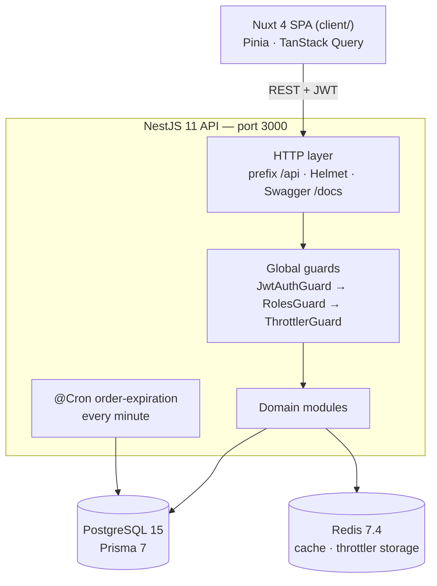
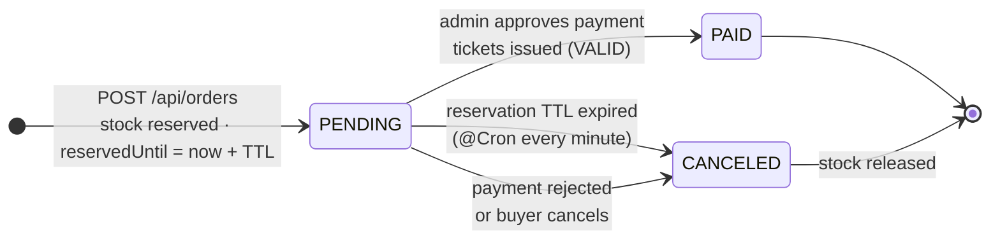
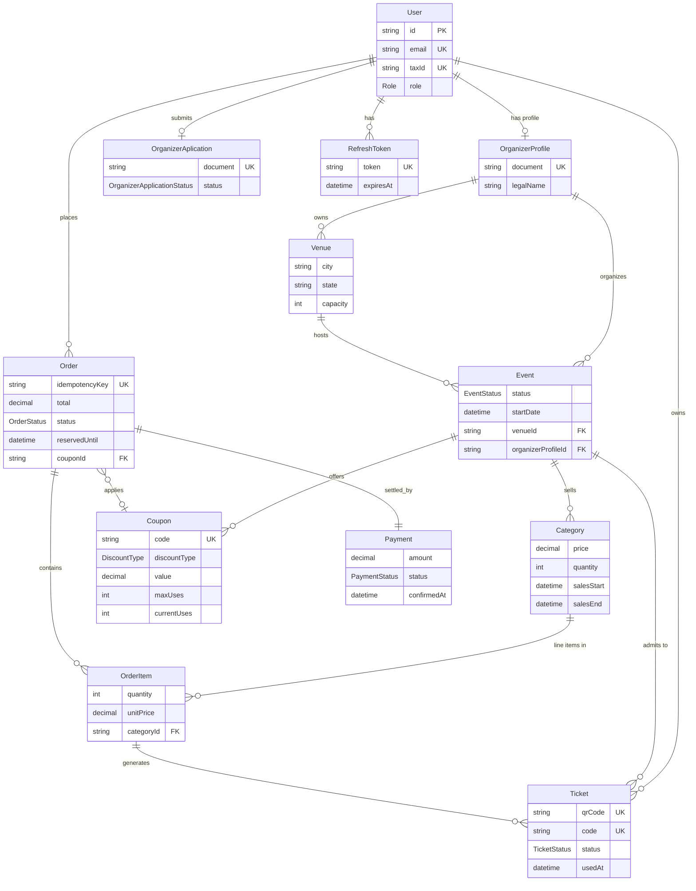

# Ticket Já API

RESTful API for event ticket sales built with **NestJS 11**, **Prisma 7**, **PostgreSQL 15** and **Redis**.

## Architecture

**Modular monolith**: a Nuxt SPA talks to a NestJS REST API; PostgreSQL is the source of truth and Redis handles cache/rate limiting.

### System overview



### Order & payment lifecycle



`Payment` is 1:1 with the order: it starts `PENDING` and moves to `APPROVED` or `REJECTED` by admin confirmation — approval marks the order `PAID`, rejection cancels it. Tickets start `VALID` and move to `USED` on QR check-in (or `CANCELED` when the order is).

### Database design



| Enum | Values |
|------|--------|
| `Role` | `BUYER` · `ORGANIZER` · `ADMIN` |
| `EventStatus` | `DRAFT` · `PUBLISHED` · `FINISHED` · `CANCELED` |
| `OrderStatus` | `PENDING` · `PAID` · `CANCELED` |
| `PaymentStatus` | `PENDING` · `APPROVED` · `REJECTED` |
| `TicketStatus` | `VALID` · `USED` · `CANCELED` |
| `DiscountType` | `PERCENTAGE` · `FIXED` |
| `OrganizerApplicationStatus` | `PENDING` · `APPROVED` · `REJECTED` |

## Tech Stack

| Layer | Technology |
|-------|-----------|
| Runtime | Node.js + TypeScript (ES2023) |
| Framework | NestJS 11 (Express) |
| ORM | Prisma 7 (native PostgreSQL adapter) |
| Database | PostgreSQL 15 |
| Cache / Rate-limit store | Redis 7.4 |
| Auth | JWT (passport-jwt) with refresh tokens |
| Payments | Manual admin confirmation (no gateway) |
| API Docs | Swagger/OpenAPI at `/docs` |
| Frontend | Nuxt 4 SPA (Vue 3 + TypeScript, `ssr: false`) |
| UI | Nuxt UI v4 + Tailwind v4 |
| Client state | Pinia |
| Client data / forms | TanStack Vue Query (`@peterbud/nuxt-query`) + vee-validate/Zod |
| Testing | Jest 30 (unit) + Supertest (e2e) |
| Container | Docker multi-stage + Docker Compose |

## Quick Start

### Prerequisites

- **Node.js 24+** with **Corepack** (activates the pinned Yarn 4)
- **Docker** + **Docker Compose**
- **Git**

### 1. Clone the repository

```bash
git clone https://github.com/gabrii3lmao/Ticket-Ja.git
cd Ticket-Ja
```

### 2. Install dependencies

```bash
corepack enable
yarn install
```

### 3. Configure environment variables

```bash
cp .env.example .env
```

### 4. Start PostgreSQL and Redis

```bash
docker compose up -d
# or
podman-compose up -d
```

### 5. Set up the database

```bash
yarn prisma generate        # generate the Prisma client
yarn prisma migrate deploy  # apply migrations
yarn prisma db seed         # load seed data
```

### 6. Run the API

```bash
yarn start:dev
```

The API runs at `http://localhost:3000`. Swagger docs are available at `http://localhost:3000/docs` (disabled in production).

### 7. Run the frontend (client)

In a second terminal:

```bash
cd client
yarn install     # postinstall runs `nuxt prepare`
yarn dev         # SPA on http://localhost:5173, proxies /api and /docs to :3000
```

## Frontend

The frontend is a **Nuxt 4 SPA** (Vue 3 + TypeScript, `ssr: false`) located in `client/` as a standalone Yarn 4 project. It is a single app serving three roles — **customer**, **organizer** and **admin** — and consumes the API at `/api`.

**Stack:** Nuxt UI v4 + Tailwind v4 for UI, Pinia for client state (auth, checkout), TanStack Vue Query (`@peterbud/nuxt-query`) for data fetching, vee-validate + Zod for forms, and VueUse + `qrcode` where needed.

```
client/app/
├── assets/css/     global Tailwind + Nuxt UI styles
├── components/     layout/ | ui/ | event/ | venue/ | order/
├── composables/    useApi, useAuth + catalog/ events/ venues/ orders/ organizers/ payments/
├── layouts/        default, admin
├── middleware/     auth, admin, organizer
├── pages/          public + admin/ + organizador/ + minha-conta/ + checkout/
├── stores/         auth, checkout (Pinia)
├── types/          api.ts, admin.ts, organizer.ts
└── utils/          api.ts, format.ts, error.ts
```

## Environment Variables

See `.env.example` for the full list. Key variables:

```bash
DATABASE_URL=                    # PostgreSQL connection string
REDIS_URL=                       # Redis connection string (cache + rate-limit store)
JWT_SECRET=                      # Access token signing key
JWT_REFRESH_SECRET=              # Refresh token signing key
ORDER_RESERVATION_TTL_MINUTES=   # PENDING order reservation TTL (default 15)
```

## Scripts

```bash
yarn start:dev       # Dev server with watch
yarn start:prod      # Production build
yarn test            # Unit tests
yarn test:e2e        # E2E tests (requires running DB)
yarn test:cov        # Coverage report
yarn lint            # ESLint with type-aware rules
yarn build           # Production build
yarn prisma studio    # Database browser
yarn prisma db seed   # Seed database
```

## Documentation

- [`docs/API.md`](docs/API.md) — full endpoint reference with request/response examples.
- [`docs/PAYMENTS.md`](docs/PAYMENTS.md) — manual payment flow, reservation expiry and idempotency.
- [`docs/ARCHITECTURE.md`](docs/ARCHITECTURE.md) — design decisions, request lifecycle and conventions.

## License

UNLICENSED.
